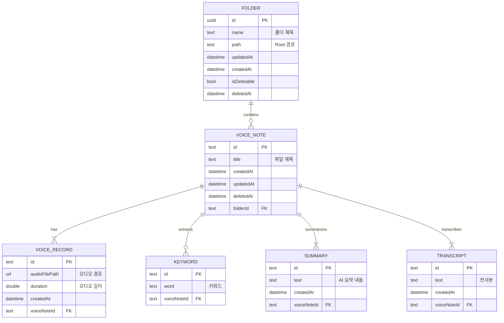

# ChaGok (차곡) - Database ERD

AI 기반 음성 메모 정리 서비스 **'차곡(ChaGok)'**의 데이터베이스 설계를 위한 ERD 저장소입니다.

## 📌 프로젝트 개요
'차곡'은 사용자의 음성 녹음을 체계적으로 관리하고, AI를 활용하여 전사(Transcript), 요약(Summary), 키워드 추출(Keyword) 기능을 제공하는 서비스입니다. 본 저장소는 이 서비스의 핵심 데이터 구조를 설계한 ERD 파일을 포함하고 있습니다.

## 🛠 설계 도구
- [ERD Editor](https://github.com/dineug/erd-editor) (VS Code Extension 또는 웹 버전 사용 가능)
- 파일 형식: `.erd` (JSON 기반)

## 📊 ERD 구조 (Mermaid)

## 🗂 주요 엔티티 설명
- **Folder**: 메모를 분류하기 위한 디렉토리 구조입니다. '기본 폴더'를 포함하며 삭제 가능 여부를 관리합니다.
- **VoiceNote**: 음성 메모의 메타데이터를 관리하는 중심 엔티티입니다.
- **VoiceRecord**: 실제 녹음된 오디오 파일의 경로와 길이를 저장합니다.
- **Keyword**: AI가 분석하여 추출한 핵심 키워드 목록입니다.
- **Summary**: AI가 생성한 녹음 내용의 요약본입니다.
- **Transcript**: 음성을 텍스트로 변환한 전체 전사본 내용입니다.

## 🚀 시작하기
1. `ChaGok.erd` 파일을 다운로드합니다.
2. [ERD Editor](https://erd-editor.io/) 또는 VS Code에서 **ERD Editor** 확장을 사용하여 파일을 엽니다.
3. 시각화된 데이터 구조를 확인하고 필요에 따라 SQL 스크립트로 내보낼 수 있습니다.
